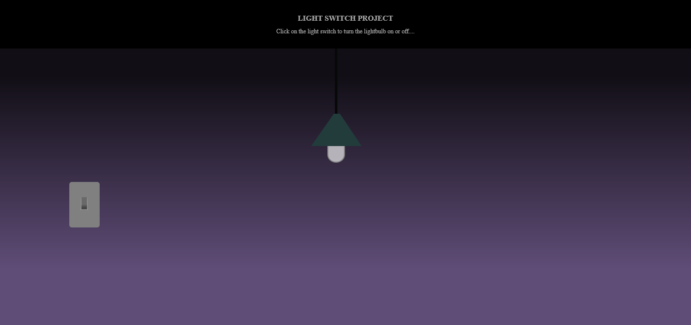

# lightSwitch002

[lightSwitch002](https://svdwebtech.github.io/lightSwitch002/) is a simple website to demonstate DOM manipulation skills. 

## Table of contents

- [lightSwitch002](#lightswitch002)
  - [Table of contents](#table-of-contents)
  - [Overview](#overview)
    - [Screenshot](#screenshot)
    - [Links](#links)
  - [My process](#my-process)
    - [Built with](#built-with)
    - [What I learned](#what-i-learned)
  - [Author](#author)
  - [Acknowledgments](#acknowledgments)

## Overview

### Screenshot

### Links

- Live Site URL: [https://svdwebtech.github.io/lightSwitch002/](https://svdwebtech.github.io/lightSwitch002/)

## My process

### Built with

- Semantic HTML5 markup
- CSS custom properties
- JavaScript

### What I learned

Learned how to select DOM elements and toggle classes.

## Author

- Website - [Schalk van Dyk](https://www.schalkvandyk.com)
- LinkedIn Profile - [@SVDwebtech](https://www.linkedin.com/in/SVDwebtech/)
- GitHub Profile - [@SVDwebtech](https://github.com/SVDwebtech/)
- Facebook Page - [@SVDwebtech](https://web.facebook.com/SVDwebtech/)
- Twitter Profile - [@SVDwebtech](https://twitter.com/SVDwebtech/)

## Acknowledgments

Thank you to my wife for all her support and an endless stream of coffees to keep me going.

